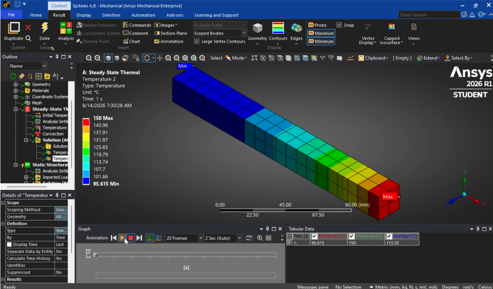

https://github.com/user-attachments/assets/24f6b404-a5fc-4555-96ec-2cdbba40be0a

# Coupled Thermal-Structural FEA Simulation of Aluminum Alloy Beam

This repository contains a one-way coupled **Thermal-Structural Finite Element Analysis (FEA)** performed in **ANSYS Workbench (Mechanical Enterprise)**. The simulation evaluates heat distribution across a solid rectangular beam and analyzes the resulting internal thermal stresses under rigid boundary constraints.

---

---

## 📌 Project Overview

When structural components undergo temperature changes while constrained, thermal expansion generates high internal stresses. This project models a two-part multiphysics pipeline:
1. **Steady-State Thermal Analysis:** Solves for thermal equilibrium and temperature fields across the geometry.
2. **Static Structural Analysis:** Imports the thermal load field and calculates the resulting thermal strain, displacement, and von Mises stress distribution.

---

## ⚙️ Simulation Setup & Parameters

| Parameter | Value / Condition | Description |
| :--- | :--- | :--- |
| **Geometry** | 3D Rectangular Prism | $90\text{ mm} \times 15\text{ mm} \times 15\text{ mm}$ |
| **Material** | Aluminum Alloy | High thermal conductivity ($k$), $\alpha \approx 23 \times 10^{-6}/\text{K}$ |
| **Thermal BC 1** | Fixed Temperature | $150^\circ\text{C}$ applied to left end face |
| **Thermal BC 2** | Convection | Ambient film coefficient applied to exterior surfaces |
| **Structural BC** | Fixed Supports | Both end faces fully constrained ($u_x = u_y = u_z = 0$) |

---

## 📊 Key Results

* **Temperature Field:** Heat conduction and convective dissipation established a steady-state gradient dropping from **$150^\circ\text{C}$** at the hot end face to **$95.6^\circ\text{C}$** at the cooler end.
* **Equivalent (von Mises) Stress:** Restraining natural thermal expansion created a maximum compressive stress of **$\sim 815.27\text{ MPa}$** near the constrained end boundaries.

---

## 🛠️ Tools Used

* **ANSYS Workbench / Mechanical 2026 R1** — FEA setup, meshing, coupled physics transfer, and post-processing
* **ANSYS SpaceClaim** — 3D CAD geometry modeling
